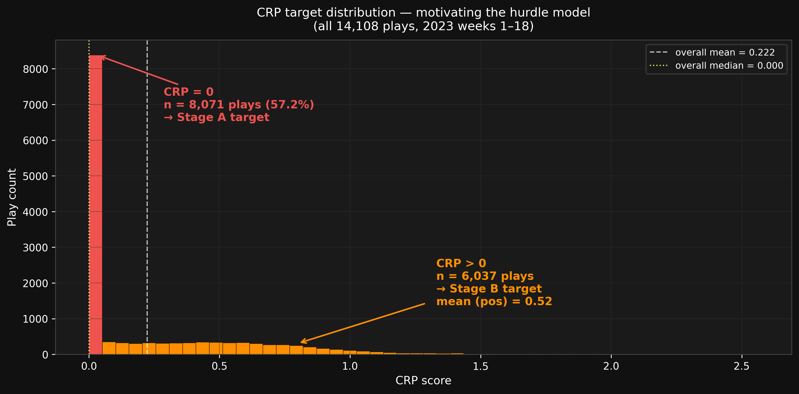
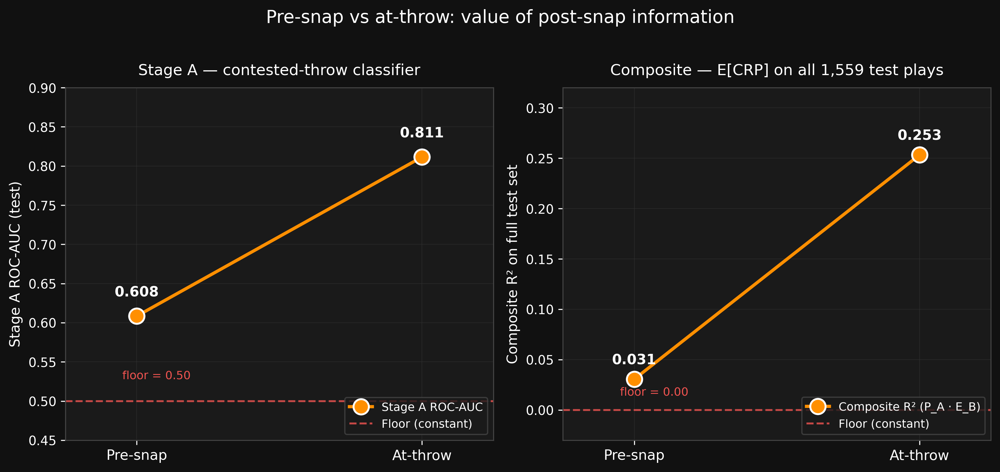
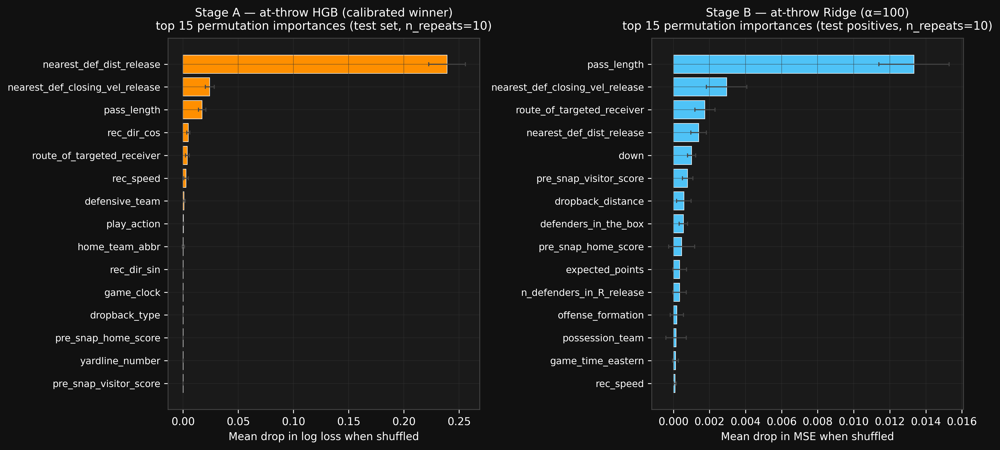
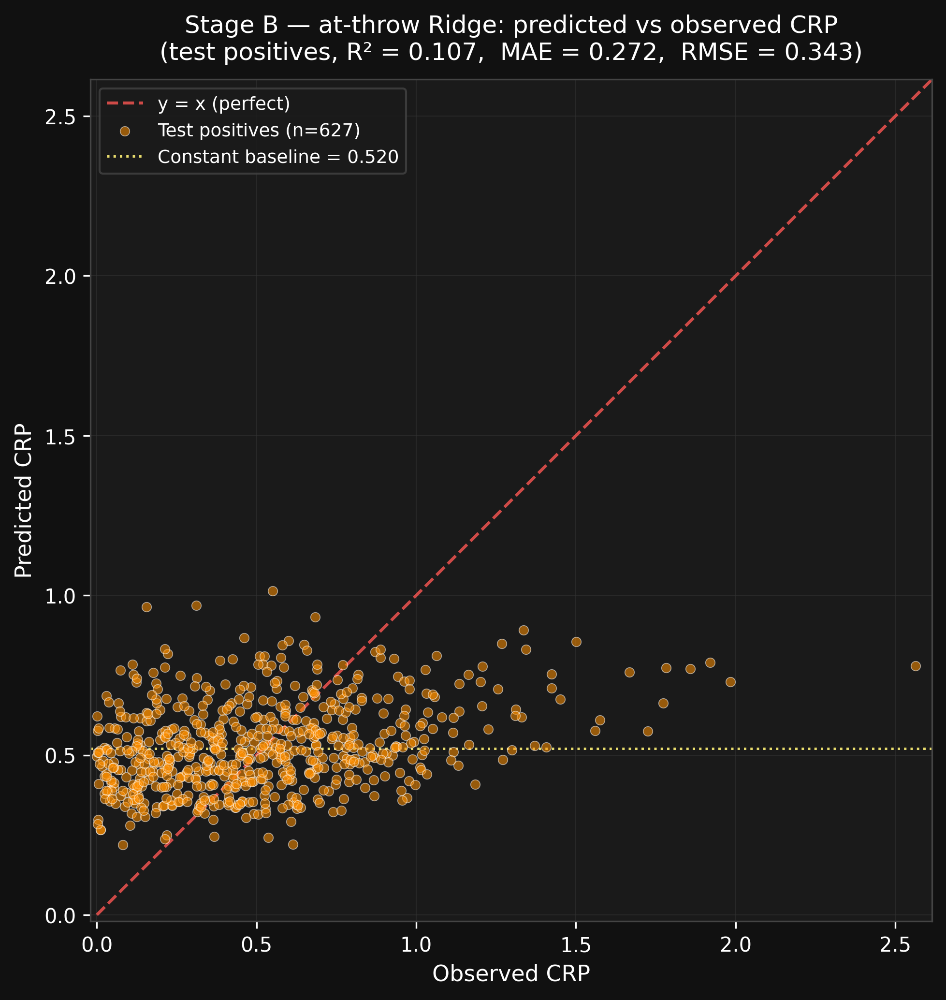
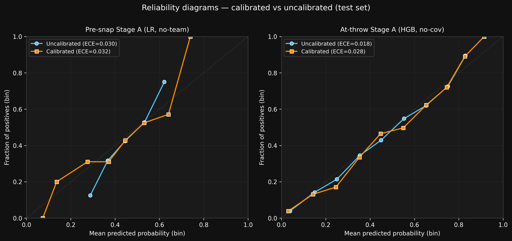

> **Internal scaffold — not the deliverable.**
>
> This file is a working markdown skeleton produced during the analysis pass.
> **The submission writeup is being authored separately by the project owner;
> this is not the paper.** Numbers, tables, and figure references here reflect
> the locked analysis as of the most recent analysis commit on `main`, but the
> prose is starting-structure only — not ship-ready.
>
> Authoritative artifacts:
> - `CRP_PREDICTIVE_MODEL_PLAN.md` — per-pass design log + final reported numbers
> - `data/test_predictions.csv` — held-out predictions
> - `outputs/12_…16_*.png` — final figures

---

# Predicting Catch Radius Pressure: Pre-snap vs At-throw

A two-stage hurdle on 2023 NFL tracking data. NFL Big Data Bowl 2026.

## TL;DR

We frame Catch Radius Pressure (CRP) as a hurdle. **Stage A** is a binary classifier — "will any defender be inside the 3-yard catch radius when the ball arrives?" **Stage B** is a regressor on the positive subset — "how contested, given that one will." With pre-snap features alone, Stage A reaches AUC 0.61 and Stage B essentially ties the play-mean baseline. Adding at-throw features (receiver separation, closing velocity, air yards, route, release-frame kinematics) lifts AUC to **0.81** and Stage B R² from ~0 to **+0.11**. The composite `E[CRP] = P_A·E_B` reaches **R² 0.25** on the full held-out test set — and one feature, `nearest_def_dist_release`, carries it.

## The target

CRP sums `(1 − dᵢ/R)(1 + vᵢ)` over defenders within `R = 3 yd` of the ball's landing point at the catch frame, weighting closer and inward-moving defenders more. The distribution is heavily zero-inflated.

57.2% of plays have CRP = 0; the positive tail is roughly exponential (mean 0.52, max 2.56). The zero mass isn't noise — it's the structural fact that most throws aren't contested at the catch point. A single regressor on this distribution is the wrong tool; a hurdle isn't.

## Data and protocol

2023 regular season weeks 1–18 (NFL BDB 2026 data), 14,107 plays after dropping a single play whose targeted receiver is off-frame at release.

- **Dev** — weeks 1–16, 12,548 plays, 240 games. **5-fold `GroupKFold` grouped by `game_id`** so no game ever spans train and validation. The fold map is materialized once on the dev pool and reused for Stage B by filtering to positives within each fold — Stages A and B always agree on which game is in which fold.
- **Test** — weeks 17–18, 1,559 plays, 32 games. Untouched during selection and tuning. One eval per final model.

**Floors** are the constant-baseline predictors: P_A = train base rate (0.43), E_B = train mean of positive CRP (0.52). Any model has to clear them on both CV and the held-out test.

## Two feature regimes

Every feature is gated by **when the information is knowable**, with leakage exclusions asserted in code:

| regime | included | excluded | n |
|---|---|---|---|
| **Pre-snap** | quarter, down/distance, field position, score/EP/WP, formation, receiver alignment, defenders in box | team identity (hurt CV), targeted route, dropback, air yards, **realized coverage** (NGS labels are post-snap) | 15 |
| **At-throw** | + air yards (`pass_length`), route, dropback type/distance, pass-location type, play action, **release-frame** receiver speed/direction (sin/cos), **release-frame** receiver–nearest-defender distance, **release-frame** closing velocity | post-throw outcome (pass result, yards gained, EPA, WP added), **catch-frame** defender count (CRP-derived) | 31 |

A note on edge cases. `pass_length` (air yards) was originally lumped with "outcome"; we reclassified it as at-throw legal because the throw trajectory is determined at release — same risk class as `dropback_distance`. `team_coverage_man_zone` / `team_coverage_type` are NGS realized-coverage labels; their classification window arguably extends slightly past release. We tested them in/out: `|Δ CV log loss| = 0.001`, `|Δ CV RMSE| = 0.0005`. Dropped for cleanliness — final at-throw set is 31 features, not 33.

A separate **team-identity diagnostic** on pre-snap Stage A (drop the four team columns): CV log loss *improved* from 0.6814 to 0.6794. Stage A's signal is football (situation, formation, field position, down/distance), not team-name memorization. The reported pre-snap Stage A uses the 15-feature no-team set.

## Models

- **Stage A** — Logistic Regression vs HistGradientBoostingClassifier; native categorical handling for HGB, one-hot + standard-scaler for LR; no target encoding. LR preferred on ties for interpretability.
- **Stage B** — Ridge regression. HGB tested in earlier passes and dropped; Stage B's signal didn't justify a non-linear regressor.

Hyperparameters tuned by GroupKFold-CV: `LR.C ∈ {0.01, 0.1, 1, 10}`, `Ridge.α ∈ {0.1, 1, 10, 100}`, HGB grid on `learning_rate × max_leaf_nodes × l2_regularization`. Final picks:

| stage / regime | model | hyperparameters |
|---|---|---|
| Stage A pre-snap | Logistic Regression (calibrated, no-team) | C = 0.01 |
| Stage A at-throw | HistGradientBoostingClassifier (uncalibrated) | lr = 0.05, max_leaf = 15, l2 = 0 |
| Stage B pre-snap | Ridge | α = 100 |
| Stage B at-throw | Ridge | α = 100 |

## Results

**Stage A — contested-throw classifier (test set, 1,559 plays):**

| metric | floor | pre-snap LR | at-throw HGB |
|---|---|---|---|
| log loss | 0.6756 | 0.6596 | **0.5122** |
| Brier | 0.2413 | 0.2336 | **0.1733** |
| accuracy | 0.5978 | 0.6087 | **0.7325** |
| ROC-AUC | 0.5000 | 0.6084 | **0.8114** |
| ECE | — | 0.032 | 0.018 |

**Stage B — Ridge on positives (test, 627 plays):**

| metric | floor | pre-snap (full pre-snap, 19 feat) | at-throw (31 feat) |
|---|---|---|---|
| MAE | 0.2832 | 0.2843 | **0.2716** |
| RMSE | 0.3635 | 0.3628 | **0.3435** |
| R² | 0.0 | +0.004 | **+0.107** |

**Composite `E[CRP] = P_A·E_B` (full 1,559 test plays):**

| | MAE | RMSE | R² |
|---|---|---|---|
| floor (constant) | 0.272 | 0.342 | 0.000 |
| pre-snap composite | 0.265 | 0.336 | +0.031 |
| **at-throw composite** | **0.205** | **0.295** | **+0.253** |

**Pre-snap Stage B is a tie with the mean.** CV MAE and R² narrowly under-perform the floor; test RMSE matches it within 0.001. Pre-snap context tells you almost nothing about *how* contested a play will be, conditional on it being contested at all. The lift from pre-snap to at-throw isn't "50% better" — it's "no signal" to "real signal."

## What's actually doing the work

For Stage A, the model is essentially **`nearest_def_dist_release`** and everything else is rounding error. Permutation drop in log loss on the test set: 0.260 for separation at release, 0.029 for closing velocity, 0.015 for air yards, ≤ 0.006 for everything else.

We initially included a count of defenders inside `R` at release, expecting it to matter (it's the obvious football-intuitive feature). It doesn't. Permutation-importance AUC drop was −0.0001 (noise); ablating it cost the model 0.0005 AUC, ~0.2% of the skill above chance. The continuous distance subsumes the binary count: distance ≤ 3 yd implies the count is ≥ 1, and the distance value carries more information besides.

Stage B importance is more distributed — air yards, formation, receiver alignment, closing velocity — but no feature dominates. Consistent with the modest R² ceiling.

The Stage B scatter shows the model's real behavior. Heavy shrinkage toward the dev positive-mean (~0.52, yellow dotted line). Good in the middle of the distribution; blind to the high tail above ~1.0. At α = 100 we're trading a lot of bias for the variance we save.

## Calibration

Both Stage A winners were tested with isotonic `CalibratedClassifierCV` using a GroupKFold-aware `PredefinedSplit`, so calibration training and base-model training never share a game.

The at-throw HGB tracks `y = x` essentially perfectly out of the box (ECE 0.018). The isotonic step buys a 0.001 log-loss improvement at a 0.010 ECE cost — a visible wobble in the [0.5, 0.7] region. **We report the uncalibrated at-throw model.** Pre-snap LR was also already well-calibrated (uncalibrated ECE 0.030, calibrated 0.032); the calibration wrapper is retained as a no-op for pipeline uniformity. Tested and not needed for the at-throw model.

## Discussion

The most useful number in this writeup is the gap between **0.61** (pre-snap AUC) and **0.81** (at-throw AUC). Pre-snap features paint a coarse situational picture: down, distance, formation, alignment. That's enough to know that 4th-and-1 in the red zone is different from 1st-and-10 at midfield — but not much more. The information needed to predict catch-frame defender geometry is overwhelmingly **what the play actually looks like at release**: how separated the receiver is, who's closing, and where the throw is going.

For Stage B, even at-throw features only reach R² 0.11. The remaining variance is in the ~1 second of ball flight the at-throw snapshot can't see. Pushing it further likely requires modeling defender trajectories over the flight window — not just the release-frame snapshot. A natural next experiment.

## Caveats

- **One season.** All numbers are from 2023. Cross-season validation is the obvious next step.
- **No team-level priors.** We tested team-identity columns and they hurt CV. We did not try season-to-date receiver/defense priors, which would be a defensible next direction.
- **At-throw edge cases.** Air yards and dropback distance are properties of a decision the QB committed to at release; we treat them as at-throw legal. Realized coverage labels (`team_coverage_*`) are excluded; their NGS classification window can extend past the throw.
- **Severity ceiling.** Stage B R² ~0.11 on the at-throw set is a ceiling for any release-frame model. To beat it, the model needs flight-window information — defender velocity vectors, ball trajectory, time-to-arrival.

---

*Code, models, and the held-out test predictions are in this repository. See `CRP_PREDICTIVE_MODEL_PLAN.md` for the per-pass design log.*
