# Catch Radius Pressure (CRP)
### NFL Big Data Bowl 2026 — Analytics Track

> **A new metric measuring defensive pressure at the catch point across 14,108 passing plays from the 2023 NFL season.**

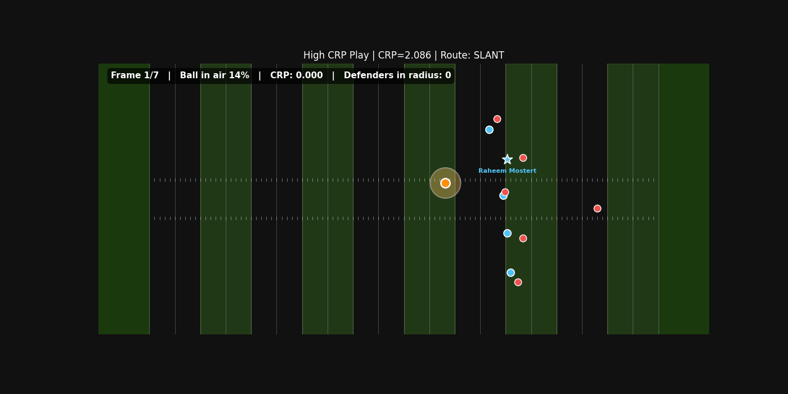

*A high-pressure play unfolding: ball in flight, defenders converging, CRP score updating frame-by-frame.*

---

## The Problem

Traditional passing metrics — completion percentage, yards after catch, EPA — tell us *what happened*. They don't tell us *how hard it was*. A receiver catching a ball wide open is evaluated the same as one fighting through traffic with two defenders closing in.

**Catch Radius Pressure (CRP)** fills that gap.

---

## What is CRP?

CRP measures how much defensive pressure exists at the exact field location where the ball arrives. For every passing play, it answers: *how crowded and contested was the catch point when the ball got there?*

### Formula

$$\text{CRP} = \sum_{i \in D_R} \left(1 - \frac{d_i}{R}\right) \cdot (1 + v_i)$$

| Variable | Definition |
|----------|-----------|
| $D_R$ | Set of defenders within catch radius $R$ |
| $d_i$ | Distance (yards) from defender $i$ to ball landing spot |
| $v_i$ | Velocity of defender $i$ toward the ball (yards/frame), floored at 0 |
| $R$ | Catch radius — default **3.0 yards** |

**Intuition:** A defender right at the catch point sprinting toward it contributes maximum pressure. A defender drifting near the edge of the radius contributes nearly nothing.

### CRP Tiers

| Score | Label |
|-------|-------|
| 0 | Open |
| 0 – 0.5 | Low Pressure |
| 0.5 – 1.0 | Moderate Pressure |
| 1.0 – 1.5 | High Pressure |
| > 1.5 | Extreme Pressure |

---

## Key Findings

### CRP predicts completion difficulty

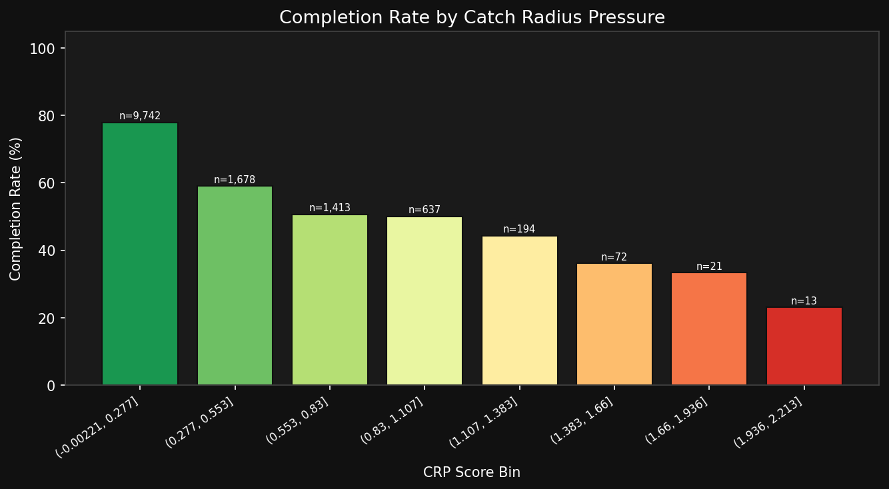

Completion rate falls cleanly with pressure:

| Tier | Completion Rate |
|------|----------------|
| Open | **79.6%** |
| Low Pressure | 65.4% |
| Moderate Pressure | 51.1% |
| High Pressure | 45.6% |
| Extreme Pressure | **37.5%** |

### Most plays are open — contested catches are rare and valuable

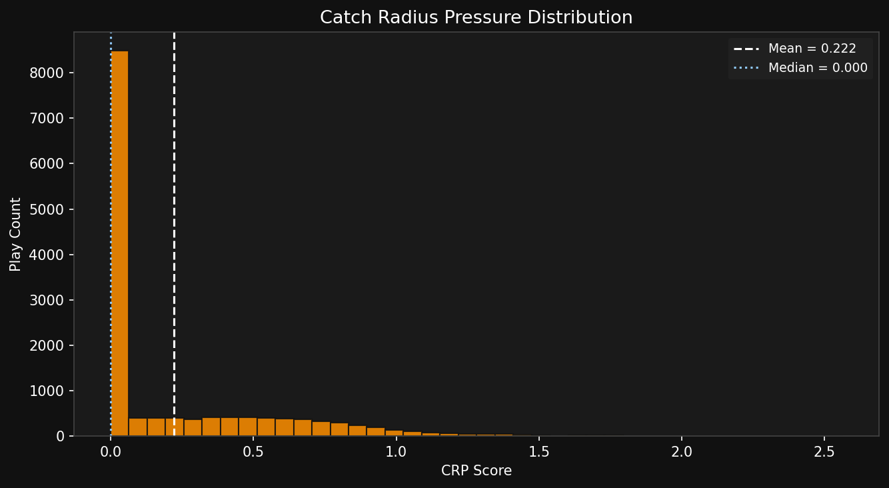

About 57% of all passing plays have no defender within the 3-yard catch radius at arrival. Truly contested catches (CRP > 1.0) make up just 3.7% of plays — and that scarcity is part of why CRP-adjusted ratings reveal what raw catch rate hides.

### Where pressure concentrates

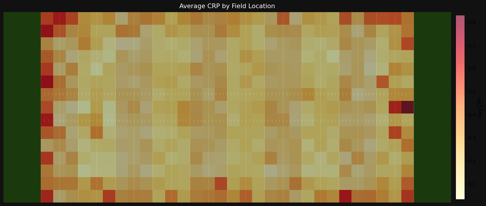

Pressure clusters in two zones: the sidelines (boundary throws) and the red zone (compressed coverage). Middle-of-field routes 10–20 yards downfield are the most open.

### Man coverage generates more CRP than zone

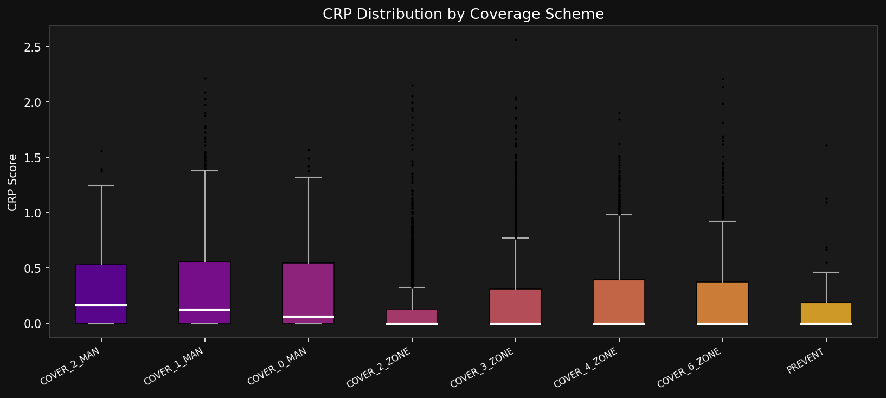

| Coverage | Avg CRP |
|----------|--------|
| COVER_1_MAN | 0.30 |
| COVER_2_MAN | 0.30 |
| COVER_0_MAN | 0.29 |
| COVER_6_ZONE | 0.21 |
| COVER_4_ZONE | 0.21 |
| COVER_3_ZONE | 0.19 |
| COVER_2_ZONE | 0.15 |

Man defenders follow receivers to the catch point. Zone defenders cover space and are less likely to converge tightly on the ball.

---

## Receiver Rankings — Catch Rate Over Expected (CROE)

For each receiver, we compare their actual catch rate to the league-wide expected catch rate given their CRP exposure. **CROE** = how much better (or worse) a receiver is than league average against the level of pressure they faced.

### Top performers (min. 30 targets)

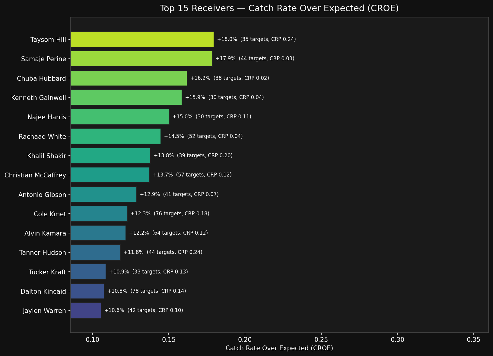

The leaderboard is dominated by **running backs and tight ends** targeted in safer zones (low avg CRP, high catch rate). But several wide receivers stand out — **Khalil Shakir** (BUF, +13.8% CROE on 39 targets at 0.20 avg CRP) and **Cole Kmet** (CHI, +12.3% CROE on 76 targets) both face moderate pressure and convert at elite rates.

### Bottom performers

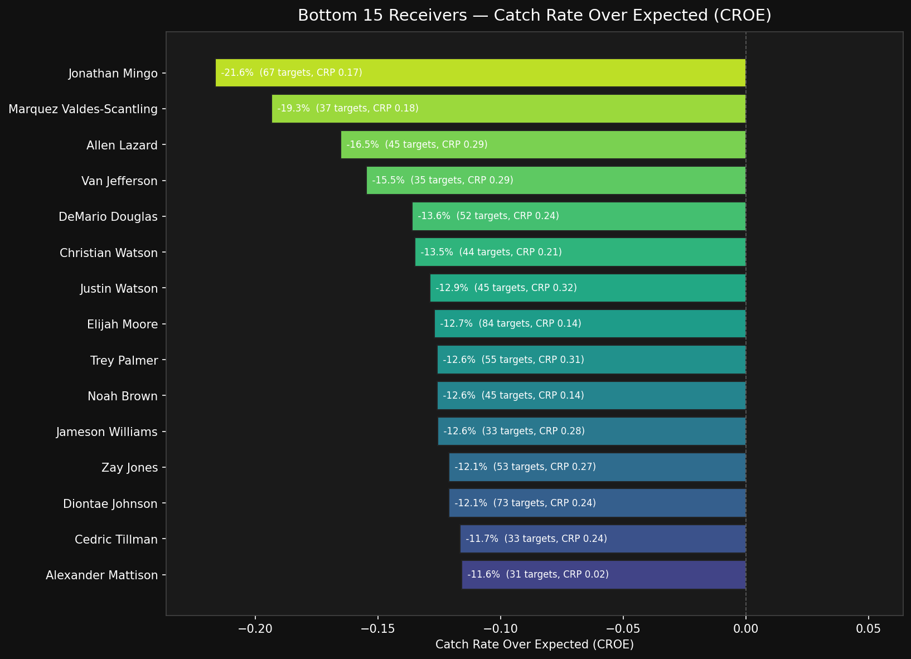

The trailing end shows receivers who under-converted given their pressure level — useful for separating tough-target volume guys from genuine inefficiency.

### Pressure specialists — who QBs trust in the toughest spots

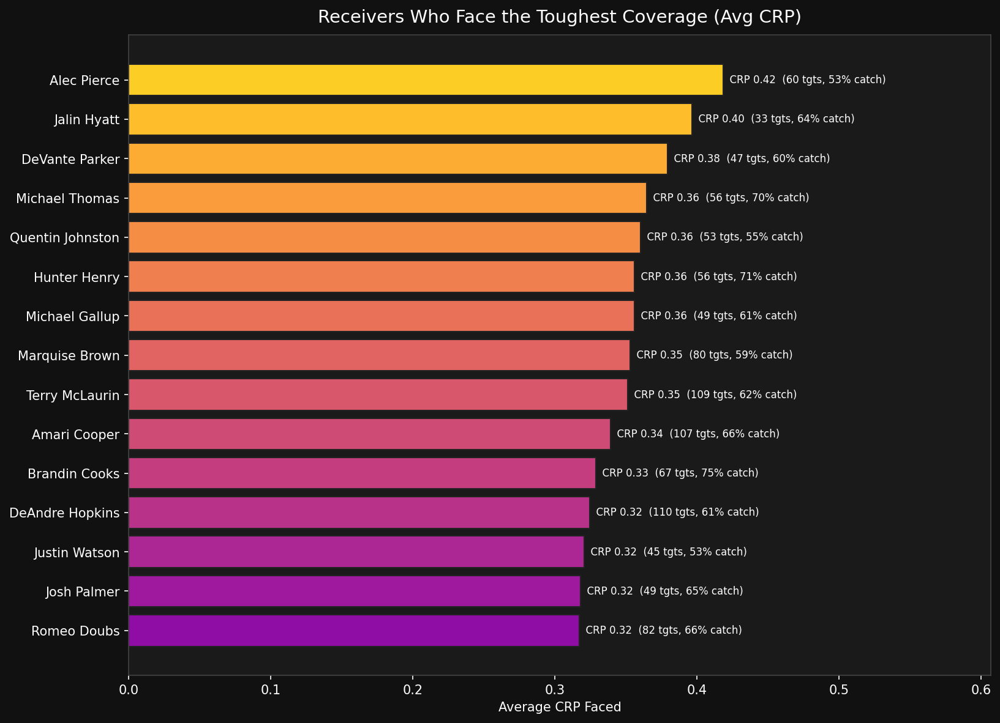

Receivers ranked by average CRP faced. These are the players quarterbacks throw to in contested situations — useful context for evaluating WR1s and red-zone targets.

---

## Team Defense Rankings

CRP also evaluates defenses: which units actually close on the ball when it matters?

### Defenses by CRP generated per pass play

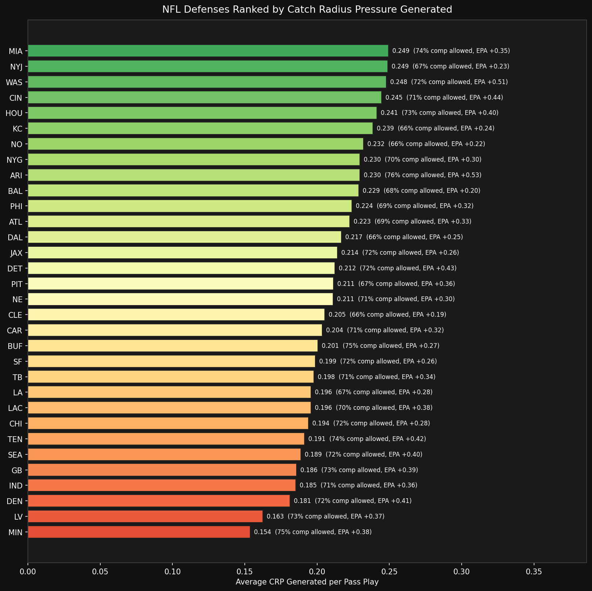

The Jets, Dolphins, Commanders, Bengals, and Texans lead the league in raw CRP generated. Notably, NYJ pairs that pressure with the **second-lowest completion rate allowed (66.9%)** — a genuinely elite pass defense. Vikings, Raiders, and Broncos sit at the bottom: defenders rarely make it into the catch radius.

### Defensive identity — pressure vs. completion allowed

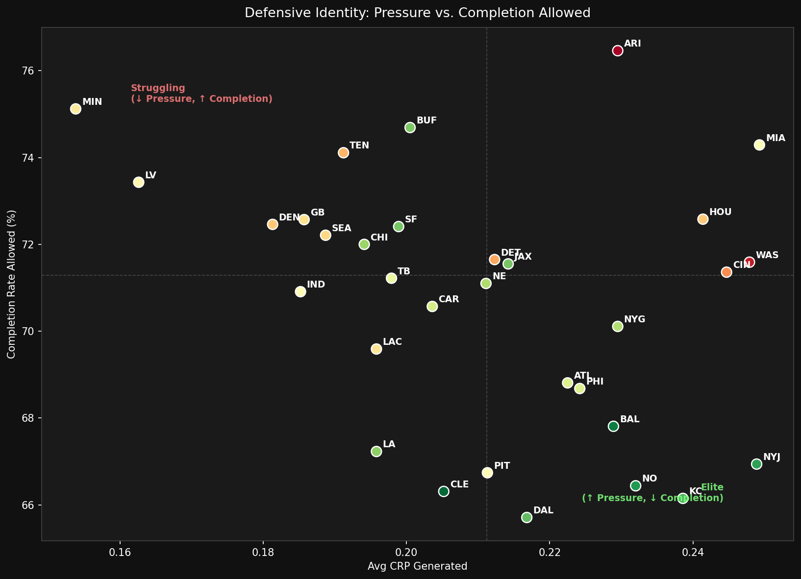

The bottom-right quadrant is where elite defenses live: high pressure generated, low completion rate allowed. NYJ, BAL, KC, NO, and CLE are the standouts. The top-right quadrant — high pressure but high completion rate — flags defenses that close on the ball but don't finish (MIA stands out here).

### Defensive Rate Over Expected (DROE)

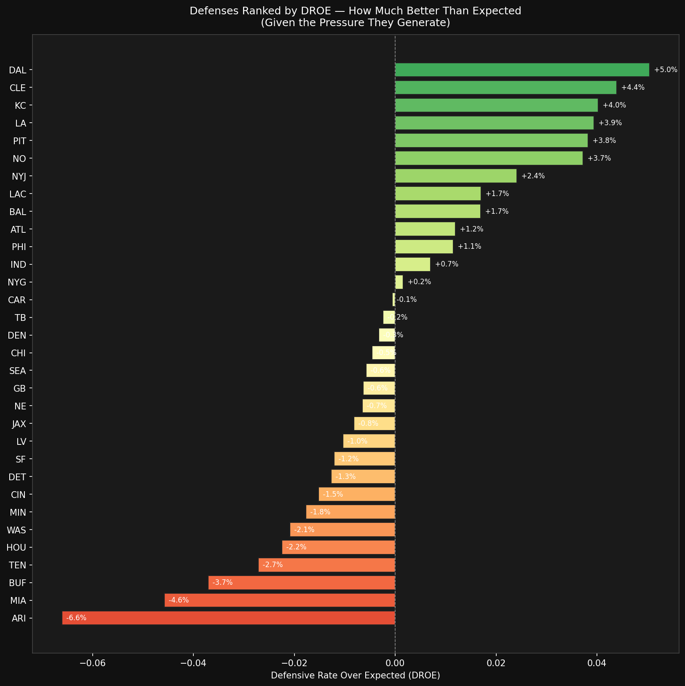

DROE is to defenses what CROE is to receivers: **how much better than expected** is their completion rate allowed, given the level of CRP they generate? Top performers in 2023:

| Rank | Team | DROE | Completion Allowed | Expected | Read |
|------|------|------|--------------------|----------|------|
| 1 | DAL | +5.0% | 65.7% | 70.8% | Elite finishing on contested plays |
| 2 | CLE | +4.4% | 66.3% | 70.7% | Elite secondary play |
| 3 | KC | +4.0% | 66.2% | 70.2% | Both pressure AND finishing |
| 4 | LAR | +3.9% | 67.2% | 71.2% | Punches above their pressure rate |
| 5 | PIT | +3.8% | 66.7% | 70.6% | T.J. Watt effect on the back end |

---

## Animated Play Examples

### High-pressure completion (CRP = 2.09, slant route, 3 defenders converging)


### Wide-open completion for contrast

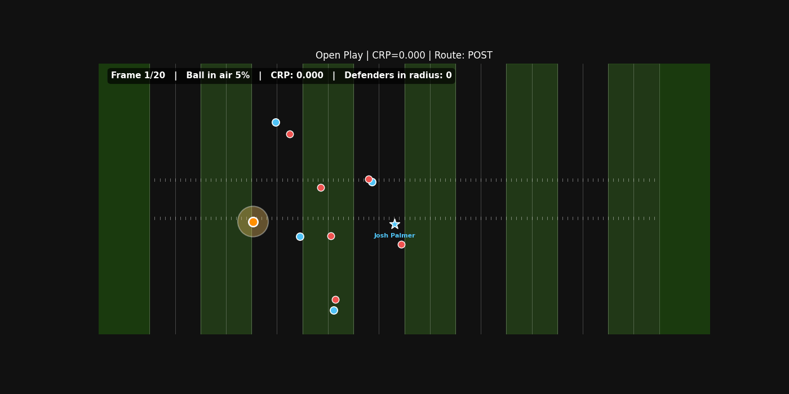

The catch-radius circle fills with color as CRP rises. The contrast between these two plays — same outcome, completely different difficulty — is exactly what CRP is built to capture.

---

## Project Structure

```
catch-radius-pressure/
├── crp/
│   ├── __init__.py          # Public API
│   ├── metric.py            # CRP formula & batch computation
│   ├── data_loader.py       # Data utilities
│   ├── visualizations.py    # Field plots, heatmaps, distributions
│   ├── rankings.py          # Player rankings & CROE
│   ├── team_defense.py      # Team defense rankings & DROE
│   └── animation.py         # Animated play GIFs
├── notebooks/
│   ├── crp_analysis.ipynb        # Full analysis walkthrough
│   └── crp_analysis_colab.ipynb  # Colab-ready version
├── scripts/
│   └── compute_crp.py       # CLI: regenerate CRP from raw data
├── data/
│   ├── crp_all_weeks.csv    # 14,108 plays, CRP only
│   ├── crp_merged.csv       # CRP + supplementary metadata
│   ├── play_targets.csv     # Play → targeted receiver lookup
│   ├── receiver_rankings.csv # Computed receiver rankings
│   └── team_defense_rankings.csv # Team defense rankings
└── outputs/                 # All charts & animated GIFs
```

---

## Getting Started

### Option A: Google Colab (zero setup)

1. Open [Google Colab](https://colab.research.google.com)
2. Upload the project zip and run: `!unzip catch_radius_pressure_project.zip -d /content/`
3. Open `notebooks/crp_analysis_colab.ipynb` and run all cells

### Option B: Local

```bash
git clone https://github.com/Stevenmarathias/catch-radius-pressure.git
cd catch-radius-pressure
pip install -r requirements.txt
jupyter notebook notebooks/crp_analysis.ipynb
```

To recompute CRP from raw competition data:
```bash
python scripts/compute_crp.py --data_dir /path/to/competition/data
```

---

## API Reference

```python
from crp import compute_crp_for_play, compute_crp_dataset, load_week
from crp.rankings import compute_player_rankings
from crp.team_defense import compute_team_defense_rankings
from crp.animation import animate_play

# Single play
result = compute_crp_for_play(defenders_df, ball_land_x, ball_land_y)

# Full week batch
df_in, df_out = load_week(week=1)
df_crp = compute_crp_dataset(df_in, df_out)

# Player rankings
rankings = compute_player_rankings(df_crp_merged, play_targets, min_targets=30)

# Team defense rankings
team_rankings = compute_team_defense_rankings(df_crp_merged, min_plays=100)

# Animate a play
animate_play(df_in, df_out, game_id=2023091010, play_id=3826,
             output_path="play.gif")
```

---

## Future Work

- **Quarterback bravery index**: do QBs throw into pressure or take the safe option?
- **Temporal CRP decomposition**: separate "tight at release" from "late-closing" pressure
- **Coverage scheme deep-dive**: which specific man/zone variants generate pressure most efficiently?
- **Red zone CRP**: does pressure inside the 20 behave differently than open-field pressure?

---

## Data

Provided by the NFL via [Big Data Bowl 2026](https://www.kaggle.com/competitions/nfl-big-data-bowl-2026).  
2023 NFL season tracking data: Weeks 1–18.

---

*NFL Big Data Bowl 2026 | Analytics Track*  
*Author: [@Stevenmarathias](https://github.com/Stevenmarathias)*
