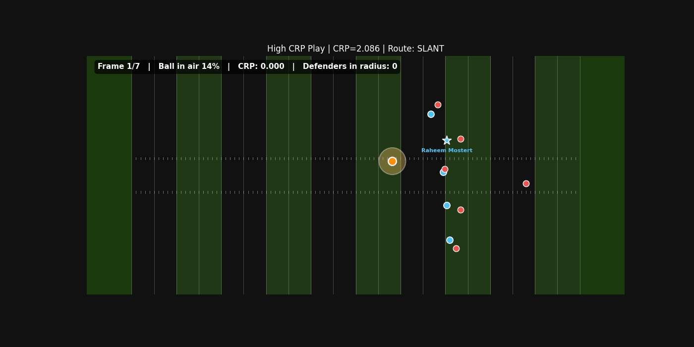
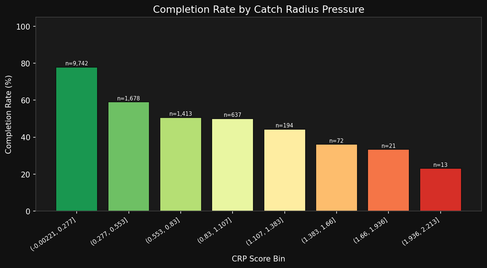
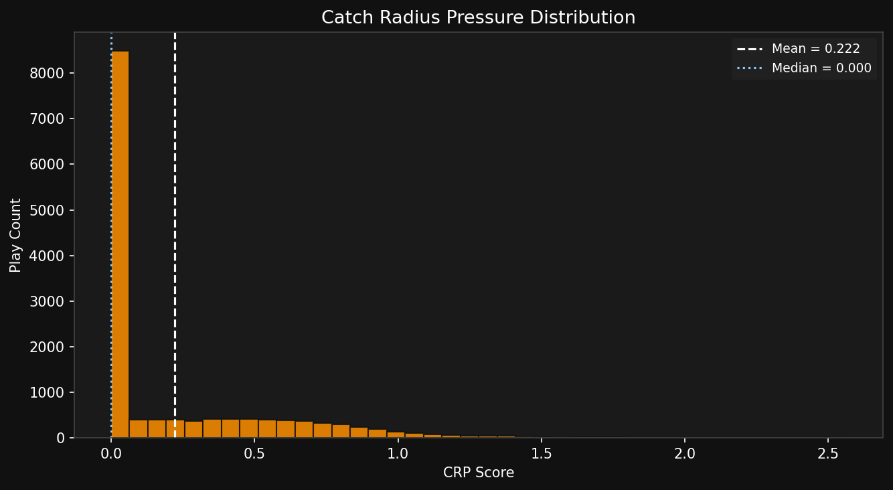
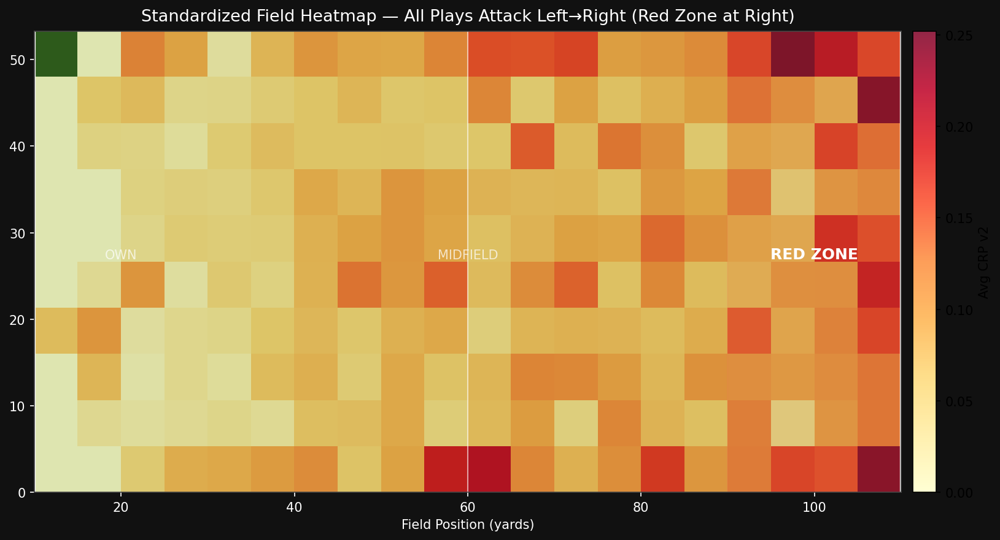
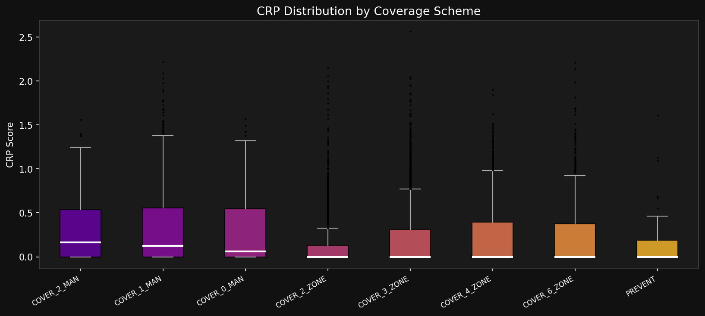
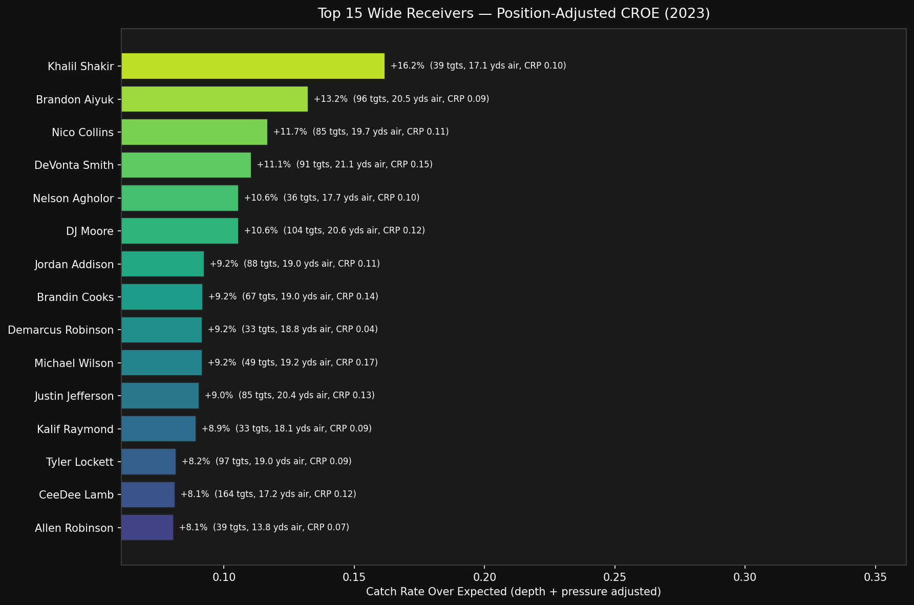
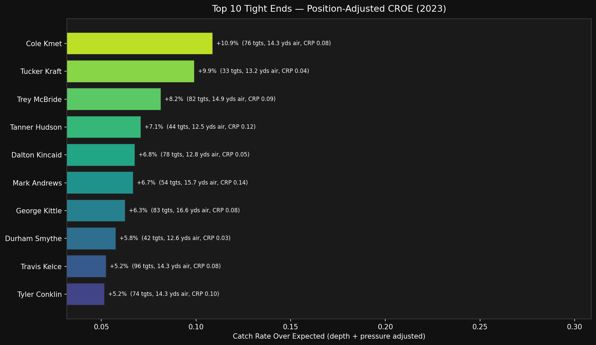
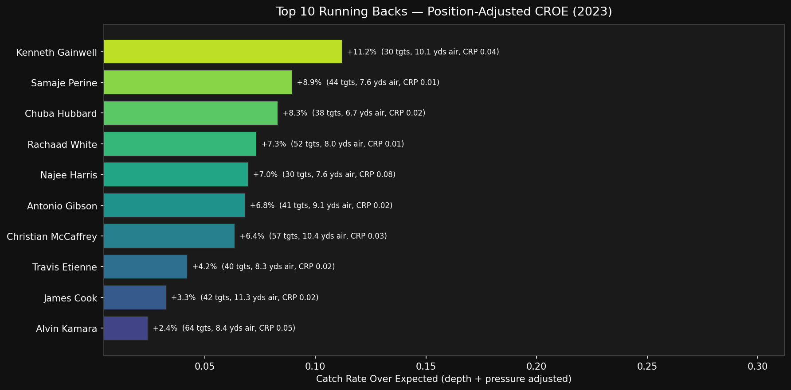
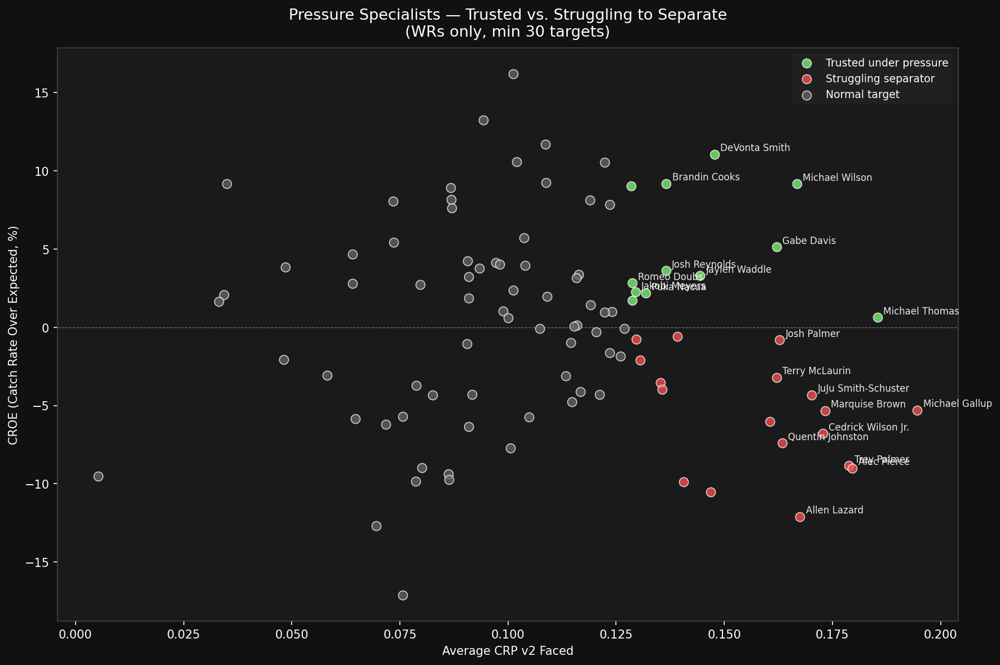
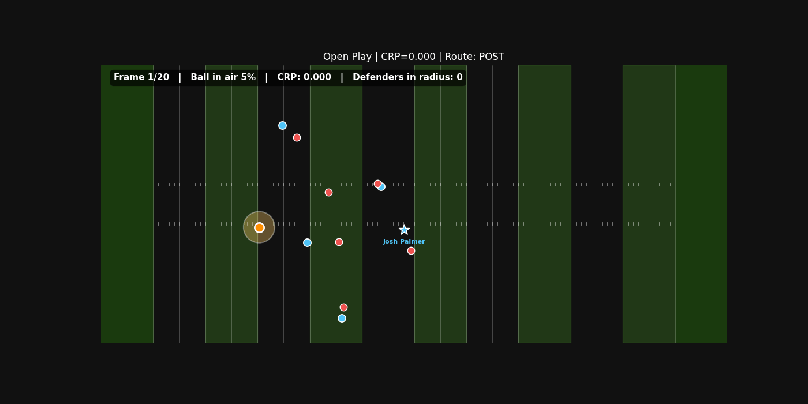

# Catch Radius Pressure (CRP)
### NFL Big Data Bowl 2026 — Analytics Track

> **A new metric measuring defensive pressure at the catch point across 14,108 passing plays from the 2023 NFL season.**

> **Note:** CRP has been substantially revised. See [CRP_V2_METHODOLOGY.md](CRP_V2_METHODOLOGY.md) for the current methodology (v2), which adds receiver context to the formula, standardizes field coordinates, and produces position- and depth-adjusted receiver rankings. The rankings and pressure-specialist sections below reflect v2.



*A high-pressure play unfolding: ball in flight, defenders converging, CRP score updating frame-by-frame.*

---

## The Problem

Traditional passing metrics — completion percentage, yards after catch, EPA — tell us *what happened*. They don't tell us *how hard it was*. A receiver catching a ball wide open is evaluated the same as one fighting through traffic with two defenders closing in.

**Catch Radius Pressure (CRP)** fills that gap.

---

## What is CRP?

CRP measures how much defensive pressure exists at the exact field location where the ball arrives. For every passing play, it answers: *how crowded and contested was the catch point when the ball got there?*

### Formula

$$\text{CRP} = \sum_{i \in D_R} \left(1 - \frac{d_i}{R}\right) \cdot (1 + v_i)$$

| Variable | Definition |
|----------|-----------|
| $D_R$ | Set of defenders within catch radius $R$ |
| $d_i$ | Distance (yards) from defender $i$ to ball landing spot |
| $v_i$ | Velocity of defender $i$ toward the ball (yards/frame), floored at 0 |
| $R$ | Catch radius — default **3.0 yards** |

**Intuition:** A defender right at the catch point sprinting toward it contributes maximum pressure. A defender drifting near the edge of the radius contributes nearly nothing.

### CRP Tiers

| Score | Label |
|-------|-------|
| 0 | Open |
| 0 – 0.5 | Low Pressure |
| 0.5 – 1.0 | Moderate Pressure |
| 1.0 – 1.5 | High Pressure |
| > 1.5 | Extreme Pressure |

---

## Key Findings

### CRP predicts completion difficulty



Completion rate falls cleanly with pressure:

| Tier | Completion Rate |
|------|----------------|
| Open | **79.6%** |
| Low Pressure | 65.4% |
| Moderate Pressure | 51.1% |
| High Pressure | 45.6% |
| Extreme Pressure | **37.5%** |

### Most plays are open — contested catches are rare and valuable



About 57% of all passing plays have no defender within the 3-yard catch radius at arrival. Truly contested catches (CRP > 1.0) make up just 3.7% of plays — and that scarcity is part of why CRP-adjusted ratings reveal what raw catch rate hides.

### Where pressure concentrates



With v2's standardized field coordinates (offense always attacks left→right), the **red zone stands out as the highest-pressure area of the field: 0.158 avg CRP vs 0.039 in a team's own territory — roughly a 2× effect** that was previously washed out by mixing play directions. Sidelines remain contested; middle-of-field routes 10–20 yards downfield are still the most open.

### Man coverage generates more CRP than zone



| Coverage | Avg CRP |
|----------|--------|
| COVER_1_MAN | 0.30 |
| COVER_2_MAN | 0.30 |
| COVER_0_MAN | 0.29 |
| COVER_6_ZONE | 0.21 |
| COVER_4_ZONE | 0.21 |
| COVER_3_ZONE | 0.19 |
| COVER_2_ZONE | 0.15 |

Man defenders follow receivers to the catch point. Zone defenders cover space and are less likely to converge tightly on the ball.

---

## Receiver Rankings — Catch Rate Over Expected (CROE)

For each receiver, we compare their actual catch rate to the expected catch rate given both their CRP v2 exposure **and their average air yards (depth of target)**. Rankings are computed **within position groups** (WR / TE / RB), so a flat-route RB no longer competes against a downfield WR on the same leaderboard. This fixes v1's biggest issue — where role artifacts dominated the top of the list.

### Top WRs



With depth- and position-adjusted expectations, the WR leaderboard is now full of actual elite receivers. **Khalil Shakir, Nico Collins, DeVonta Smith, DJ Moore, and CeeDee Lamb** all convert well above expectation on downfield volume (avg air yards ~17–21). This is the group the v1 metric was under-crediting because their expected catch rate was being computed against the whole league — including short-route specialists.

### Top TEs



**Cole Kmet leads the tight ends** — a top target on high-volume looks, converting at an elite rate for his depth profile.

### Top RBs



**Samaje Perine leads the RBs.** He was near the top of the v1 all-position leaderboard, which was misleading — RBs catch mostly low-difficulty targets. In v2 he's ranked as an elite *pass-catching RB* against other RBs, which is the honest read.

### Pressure specialists — trusted vs. struggling



A single "avg CRP faced" ranking is ambiguous: a high number could mean *the QB trusts them in contested spots* **or** *they can't get open, so every throw to them looks contested*. v2 splits the top 30% by CRP faced into two categories based on whether the receiver produces above expectation:

- **Trusted under pressure** (high CRP faced, positive CROE): **Michael Thomas, DeVonta Smith, Jaylen Waddle, Puka Nacua, Jakobi Meyers** — QBs go to them in tight windows and they deliver.
- **Struggling separators** (high CRP faced, negative CROE): **Michael Gallup, Alec Pierce, Trey Palmer, Marquise Brown, Quentin Johnston** — their high CRP comes from an inability to create separation, not from being schemed into contested spots.

---

## Animated Play Examples

### High-pressure completion (CRP = 2.09, slant route, 3 defenders converging)


### Wide-open completion for contrast



The catch-radius circle fills with color as CRP rises. The contrast between these two plays — same outcome, completely different difficulty — is exactly what CRP is built to capture.

---

## Project Structure

```
catch-radius-pressure/
├── crp/
│   ├── __init__.py          # Public API
│   ├── metric.py            # CRP formula & batch computation
│   ├── data_loader.py       # Data utilities
│   ├── visualizations.py    # Field plots, heatmaps, distributions
│   ├── rankings.py          # Player rankings & CROE
│   └── animation.py         # Animated play GIFs
├── notebooks/
│   ├── crp_analysis.ipynb        # Full analysis walkthrough
│   └── crp_analysis_colab.ipynb  # Colab-ready version
├── scripts/
│   └── compute_crp.py       # CLI: regenerate CRP from raw data
├── data/
│   ├── crp_all_weeks.csv    # 14,108 plays, CRP only
│   ├── crp_merged.csv       # CRP + supplementary metadata
│   ├── play_targets.csv     # Play → targeted receiver lookup
│   └── receiver_rankings.csv # Computed rankings
└── outputs/                 # All charts & animated GIFs
```

---

## Getting Started

### Option A: Google Colab (zero setup)

1. Open [Google Colab](https://colab.research.google.com)
2. Upload the project zip and run: `!unzip catch_radius_pressure_project.zip -d /content/`
3. Open `notebooks/crp_analysis_colab.ipynb` and run all cells

### Option B: Local

```bash
git clone https://github.com/Stevenmarathias/catch-radius-pressure.git
cd catch-radius-pressure
pip install -r requirements.txt
jupyter notebook notebooks/crp_analysis.ipynb
```

To recompute CRP from raw competition data:
```bash
python scripts/compute_crp.py --data_dir /path/to/competition/data
```

---

## API Reference

```python
from crp import compute_crp_for_play, compute_crp_dataset, load_week
from crp.rankings import compute_player_rankings
from crp.animation import animate_play

# Single play
result = compute_crp_for_play(defenders_df, ball_land_x, ball_land_y)

# Full week batch
df_in, df_out = load_week(week=1)
df_crp = compute_crp_dataset(df_in, df_out)

# Player rankings
rankings = compute_player_rankings(df_crp_merged, play_targets, min_targets=30)

# Animate a play
animate_play(df_in, df_out, game_id=2023091010, play_id=3826,
             output_path="play.gif")
```

---

## Future Work

- **Quarterback bravery index**: do QBs throw into pressure or take the safe option?
- **Team-level coverage efficiency**: which defenses generate the most CRP per snap?
- **Temporal CRP decomposition**: separate "tight at release" from "late-closing" pressure
- **Fantasy / DFS applications**: CRP-adjusted projections for receivers in upcoming matchups

---

## Data

Provided by the NFL via [Big Data Bowl 2026](https://www.kaggle.com/competitions/nfl-big-data-bowl-2026).  
2023 NFL season tracking data: Weeks 1–18.

---

*NFL Big Data Bowl 2026 | Analytics Track*  
*Author: [@Stevenmarathias](https://github.com/Stevenmarathias)*

